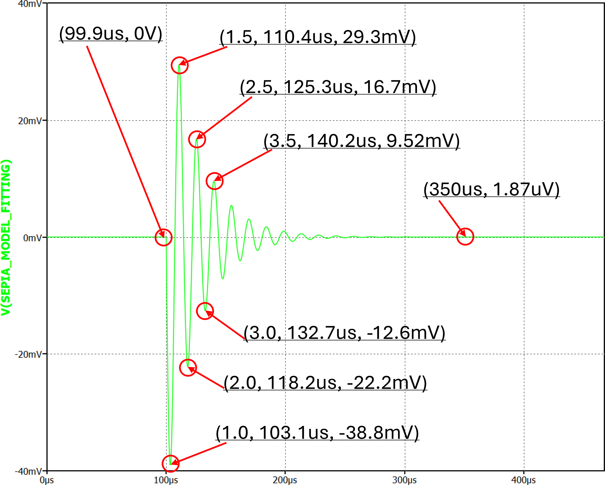
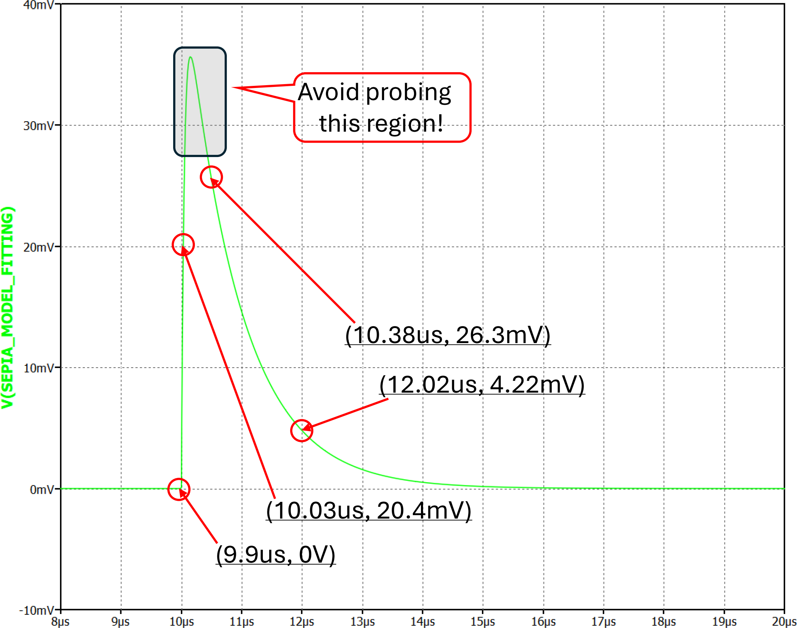
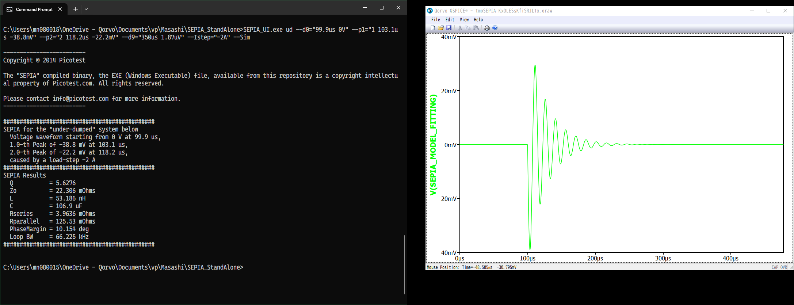

# SEPIA StandAlone

***

Table of Contents
* *about* [SEPIA](#sepia)
* [Basic Operation](#basic-operation)
* [Usage / Example](#usage--example)
* [Call for Your Help!](#call-for-your-help)
* [Related Software](#related-software)

***

## SEPIA

**SEPIA**:  **S**tability **E**valuation for **P**ower **I**ntegrity **A**nalysis

The [SEPIA]() is a control loop stability analysis tool developed by [Mr. Steve Sandler](https://www.signalintegrityjournal.com/authors/20-steve-sandler) at [Picotest.com](https://picotest.com).

The SEPIA extracts **frequency-domain parameters** of our target circuit/loop, **directly from time-domain, load transient responses**.

The SEPIA method is based on a simple fact that every single circuit sharing the same qualify factor **Q** exhibits the mathematically **"similar"** ringing to decay shape by assuming it is a quadratic system.

## SEPIA Copyright Notice

***Copyright © 2014 Picotest***

***The "SEPIA" compiled binary, the EXE (Windows Executable) file, available from this repository is a copyright intellectual property of [Picotest.com](https://picotest.com).  All rights reserved.***

Please contact [info@picotest.com](mailto:info@picotest.com) for more information.

***

## Basic Operation

1. Download two (2) **".exe"** files, in this repositry, into your working folder/directory.
2. The **SEPIA StandAlone** program is **NOT** GUI software.  
Prepare Windows command console first, for example **cmd.exe**, **Powershell.exe**, **git-bash.exe**,...
3. Run the UI (User Interface) program **SEPIA_UI.exe** with proper parameters.  
See [Usage / Example](#usage--example) below for the detail.

## Usage / Example

> [!NOTE]
> I - the author of this README file - is using **git-bash.exe**.
> Please pay attention how to use double quotation charactors on your console program.

### Usage Display with No Parameter

Calling the **SEPIA_UI.exe** with no paramter is a handy way copy & paste this long parameter list.

```
prompt>>  SEPIA_UI.exe
#######################################################################
## ERROR:  The first parameter should be either one of "od" or "ud". ##
#######################################################################

Usage #1::  You have an over-dump response:
>> SEPIA_UI.exe od --d0="0 0" --d1="33ns 20.366mV" --d2="0.375us 26.316mV" --d3="2.015us 4.2168mV" --Istep="500uA" --Sim

  or

Usage #2::  You have an under-dump response:
>> SEPIA_UI.exe ud --d0="0 0" --p1="1 3.077us -38.81mV" --p2="1.5 10.43us 29.3mV" --Istep="-2A" --Sim

```

### SEPIA Analysis for Under-Dumped VRM Loops

We use the example response curve below.



From the curve, we pick two (2) of ringing peaks by specifying the **peak numbers**.  
The main / first peak is **#1 (number one)**.  We call it overshoot / undershoot.  
The peak following the **#1** at the opposite direction is **#1.5 (one and half)**.  
The next peak following **#1** and **#1.5**, in the same direction of **#1** is **#2 (number two)**.  
...

And we have this important information: **load step current amplitude**

Then, we also need a data point **just before the response starts** as our reference point, **call it #0**.

**Optionally**, we can feed a converging data point **call it #9** where "9" is just repsenting a big number.  
When your VRM under test has a certain load regulation differnece before and after the response, this **#9** helps.

When you have enough peaks, it is recommended to use **#1** and **#2**.

```
prompt>> SEPIA_UI.exe ud --d0="99.9us 0V" --p1="1 103.1us -38.8mV" --p2="2 118.2us -22.2mV" --d9="350us 1.87uV" --Istep="-2" --Sim

-------------------------
Copyright \xa9 2014 Picotest

The "SEPIA" compiled binary, the EXE (Windows Executable) file, available from this repository is a copyright intellectual property of Picotest.com. All rights reserved.

Please contact info@picotest.com for more information.
-------------------------

##############################################
SEPIA for the "under-dumped" system below
  Voltage waveform starting from 0 V at 99.9 us,
  1.0-th Peak of -38.8 mV at 103.1 us,
  2.0-th Peak of -22.2 mV at 118.2 us,
  caused by a load-step -2 A
##############################################
SEPIA Results
  Q           = 5.6276
  Zo          = 22.306 mOhms
  L           = 53.186 nH
  C           = 106.9 uF
  Rseries     = 3.9636 mOhms
  Rparallel   = 125.53 mOhms
  PhaseMargin = 10.154 deg
  Loop BW     = 66.225 kHz
##############################################
```

Actually, you can use other pair of peaks.
Below example uses **#1** and **#1.5**.

```
prompt>> >> SEPIA_UI.exe ud --d0="99.9us 0V" --p1="1 103.1us -38.8mV" --p2="1.5 110.4us 29.3mV" --d9="350us 1.87uV" --Istep="-2"

-------------------------
Copyright \xa9 2014 Picotest

The "SEPIA" compiled binary, the EXE (Windows Executable) file, available from this repository is a copyright intellectual property of Picotest.com. All rights reserved.

Please contact info@picotest.com for more information.
-------------------------

##############################################
SEPIA for the "under-dumped" system below
  Voltage waveform starting from 0 V at 99.9 us,
  1.0-th Peak of -38.8 mV at 103.1 us,
  1.5-th Peak of 29.3 mV at 110.4 us,
  caused by a load-step -2 A
##############################################
SEPIA Results
  Q           = 5.5921
  Zo          = 22.325 mOhms
  L           = 51.465 nH
  C           = 103.26 uF
  Rseries     = 3.9923 mOhms
  Rparallel   = 124.84 mOhms
  PhaseMargin = 10.218 deg
  Loop BW     = 68.493 kHz
##############################################
```

The SEPIA is an analog analysis, we observe tiny amount of differneces depending on how you probe the datapoints.

In the same way, we can use **#1** and **#3**.
```
Prompt>> SEPIA_UI.exe ud --d0="99.9us 0V" --p1="1 103.1us -38.8mV" --p2="3 132.7us -12.6mV" --d9="350us 1.87uV" --Istep="-2"

-------------------------
Copyright \xa9 2014 Picotest

The "SEPIA" compiled binary, the EXE (Windows Executable) file, available from this repository is a copyright intellectual property of Picotest.com. All rights reserved.

Please contact info@picotest.com for more information.
-------------------------

##############################################
SEPIA for the "under-dumped" system below
  Voltage waveform starting from 0 V at 99.9 us,
  1.0-th Peak of -38.8 mV at 103.1 us,
  3.0-th Peak of -12.6 mV at 132.7 us,
  caused by a load-step -2 A
##############################################
SEPIA Results
  Q           = 5.5872
  Zo          = 22.328 mOhms
  L           = 52.176 nH
  C           = 104.66 uF
  Rseries     = 3.9963 mOhms
  Rparallel   = 124.75 mOhms
  PhaseMargin = 10.227 deg
  Loop BW     = 67.568 kHz
##############################################

```

### SEPIA Analysis for Over-Dumped VRM Loops

We use the example response curve below.



From the curve, we pick three (3) datapoints **one before** and **two after** the overshoot/undershoot peak.  
Regarding the 2 **after peak** probing, it's very preferrable to probe these 2 separated away.
Then, we also need a data point **just before the response starts** as our reference point, **call it #0**.

> [!NOTE]
> For the over-dumped response, **Avoid probing near the peak**, as shown in the waveform.

```
prompt>> SEPIA_UI.exe od --d0="9.9us 0V" --d1="10.03us 20.4mV" --d2="10.38us 26.3mV" --d3="12.02us 4.22mV" --Istep="2"

-------------------------
Copyright © 2014 Picotest

The "SEPIA" compiled binary, the EXE (Windows Executable) file, available from this repository is a copyright intellectual property of Picotest.com. All rights reserved.

Please contact info@picotest.com for more information.
-------------------------

##############################################
SEPIA for the "over-dumped" system below
  Voltage waveform starting from 0 V at 9.9 us,
  Pre-Peak      probing of 20.4 mV at 10.03 us,
  1st Post-Peak probing of 26.3 mV at 10.38 us,
  2nd Post-Peak probing of 4.22 mV at 12.02 us,
  caused by a load-step 2 A
##############################################
SEPIA Results
  Q           = 426.87m
  R           = 22.465 mOhms
  C           = 9.5616 uF
  L           = 26.482 nH
  PhaseMargin = 79.832 deg
  Loop BW     = 133.34 kHz
##############################################
```

### 

*** Post Simulation

By adding **"--Sim"** parameter to the **SEPIA_UI.exe** program, it runs post simulation based on the SEPIA extracted result when you have the QSPICE installed.



## Advanced Information

### Customize UI Program

> [!NOTE]
> Due to the copyright, the source of **SEPIA.exe** is protected.

In this repositry, you can find the source Python code of the UI **SEPIA_UI.exe** program.  
Inside the **SEPIA_UI.exe**, we call the core program **SEPIA.exe** by translating parameters from the command line parameters into a CSV format.

The **SEPIA.exe** takes the CSV format data, **from its STDIN**.

> [!NOTE]
> You can use the **SEPIA.exe** program by feeding a CSV file

```
prompt>>  SEPIA.exe < od.csv
```
or
```
prompt>>  type ud.csv | SEPIA.exe 
```

### Call for Your Help!

By implementing other interface library into the **SEPIA_UI.exe**, this SEPIA StandAlone program can do various automated / semi-automated loop analysis.

Examples:

* VISA libraries talking to measurement equipment (oscilloscopes, analyzers)
* Data plotting libraries to load datafile from bench equipment / simulators

***

## Related Software

### QSPICE™

The 
[QSPICE](https://qspice.com) is a variant of SPICE (**S**imulation **P**rogram with **I**ntegrated **C**ircuit **E**mphasis, i.e. analog circuit simulator) software offered by [Qorvo](https://qorvo.com), that is available at **no cost**.

### PyQSPICE

The [PyQSPICE](https://github.com/Qorvo/PyQSPICE) is a [Python](https://www.python.org/) wrapper-module for the QSPICE, available from this [Qorvo repository](https://github.com/Qorvo/) on [GitHub](https://github.com/).
By using the QSPICE as a strong back-end simulator, it supports complex data processing and data plotting.

### SEPIA@QSPICE

The QSPICE supports **user-defined C++ and/or Verilog** circuit blocks.  The SEPIA processing routines are implemented as one of such user-defined circuit blocks, that is the **DLL binary** available here.

> [!IMPORTANT]
> This SEPIA@QSPICE module is a **SUB-SET of the SEPIA**, where **NOT ALL the SEPIA PROCESUREs** implemented.
